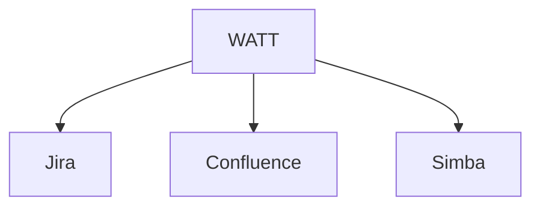
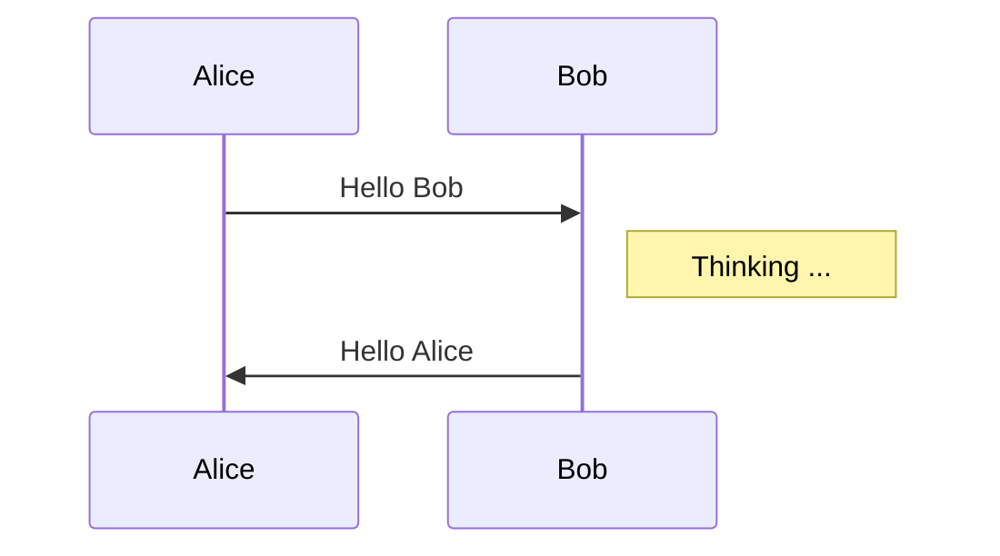
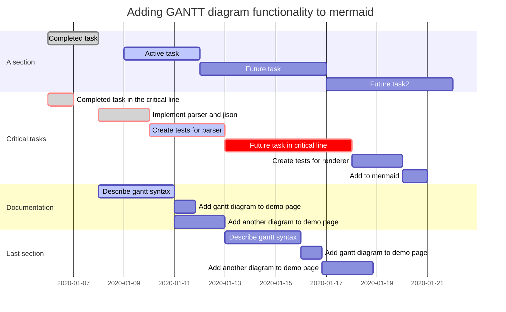
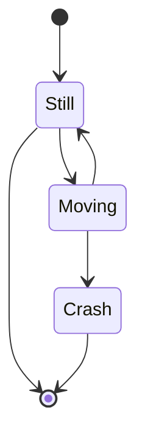
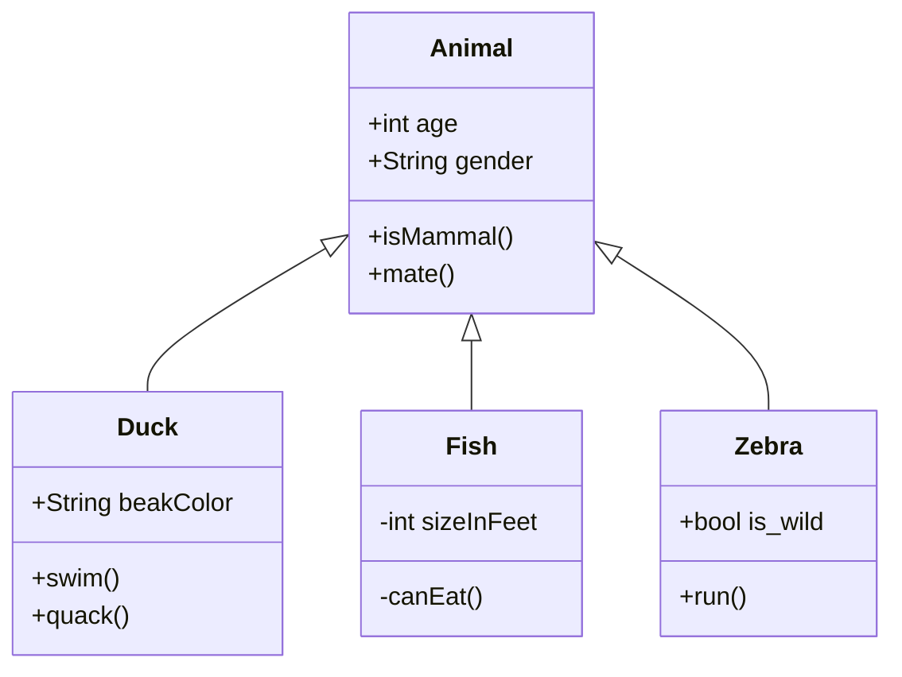
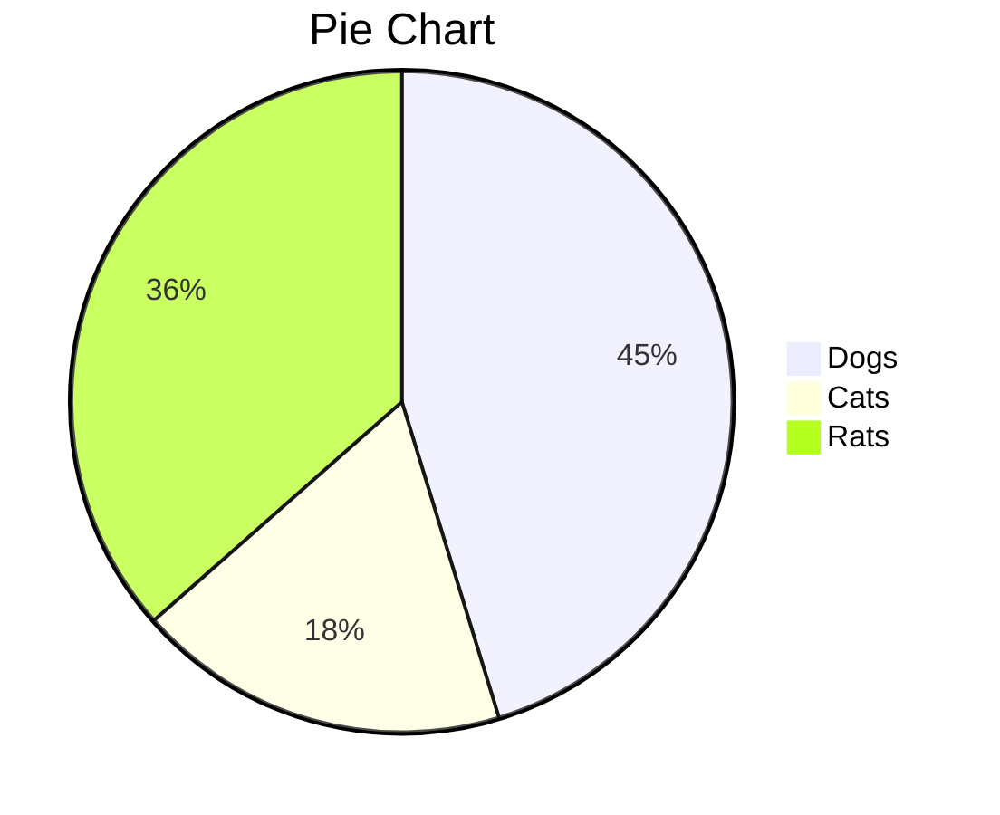

#### Graphe hiérarchique ###



#### Diagramme de séquence



#### Organigramme
```flow
st=>start: Start
op=>operation: Your Operation
cond=>condition: Yes or No?
e=>end
st->op->cond
cond(yes)->e
cond(no)->op
```


#### Diagramme de Gantt



#### Diagramme d'état


#### Diagramme de classe 


#### Camembert


